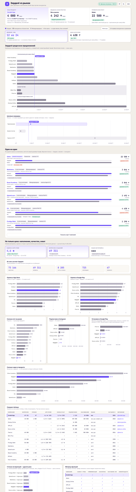

# Зерделі vs рынок — сравнительный дашборд

Сравнение Zerdeli App с конкурентами по цене, наполнению, оценкам пользователей и охвату.

**Открыть:** https://ab0ka.github.io/zerdeliappcomparative/

## Что внутри

Одна самодостаточная страница — `index.html`. Ни сборки, ни зависимостей: Chart.js и шрифты подключаются с CDN, данные о ценах читаются напрямую из Google-таблицы при каждом открытии и обновляются раз в 5 минут.

Дашборд построен как шесть шагов:

| Шаг | Что показывает |
|---|---|
| 1. Цена | ценовая карта рынка по типам продуктов и ценовые коридоры категорий |
| 2. Наполнение | объём материала, состав контента Зерделі, матрица из пяти функций |
| 3. Мнение пользователей | оценки в App Store и Google Play, отдельным рейтингом по каждому магазину |
| 4. Узнаваемость | год выхода на рынок, подписчики в Instagram, установки в Google Play |
| 5. Прямое сравнение | Зерделі против каждого конкурента по его самому дешёвому тарифу |
| 6. Данные | сводная таблица с сортировкой по любому столбцу |

Все цены приведены к одному месяцу: пакеты за квартал, полугодие и год делятся на срок, валюта пересчитывается в тенге. Реальная цена покупки показана рядом с приведённой.

## Данные

**Цены и тарифы** — лист `Raw_Prices` в Google-таблице, читается вживую. Таблица должна оставаться доступной по ссылке («Доступ по ссылке — Читатель»), иначе графики останутся пустыми.

**Наполнение, оценки и охват** — сейчас зашиты в `index.html`, блок `QUALITY_FALLBACK` в начале скрипта. Собраны вручную 12.08.2026 из App Store, Google Play, Instagram и сайтов компаний. Источник каждой цифры записан в `Quality_template.csv`, колонка `Note`.

Чтобы эти данные тоже обновлялись из таблицы, создайте в том же Google-документе лист с именем `Quality` и вставьте в него `Quality_template.csv`. Дашборд подхватит его автоматически, встроенные значения перестанут использоваться, а в подзаголовке раздела появится «лист Quality».

## Оговорки к цифрам

- Google Play показывает порог установок, а не точное число: «10 тыс.+» значит «не меньше 10 000». Внутри одного порога компании ранжировать нельзя.
- App Store число скачиваний не публикует вообще — там доступны только оценки.
- Объём контента у компаний измеряется по-разному: у Зерделі это вопросы, у Qalan — видеообъяснения к заданиям, у Khan Academy — упражнения по всем предметам K-12. Сравнение показательное, но не строгое.
- Часть казахстанских компаний объём материала не публикует совсем — у них в таблице прочерки, а не нули.

## Разработка

Файл редактируется как обычный HTML. Для локальной проверки достаточно открыть его в браузере; данные подтянутся, если есть интернет и доступ к таблице.
